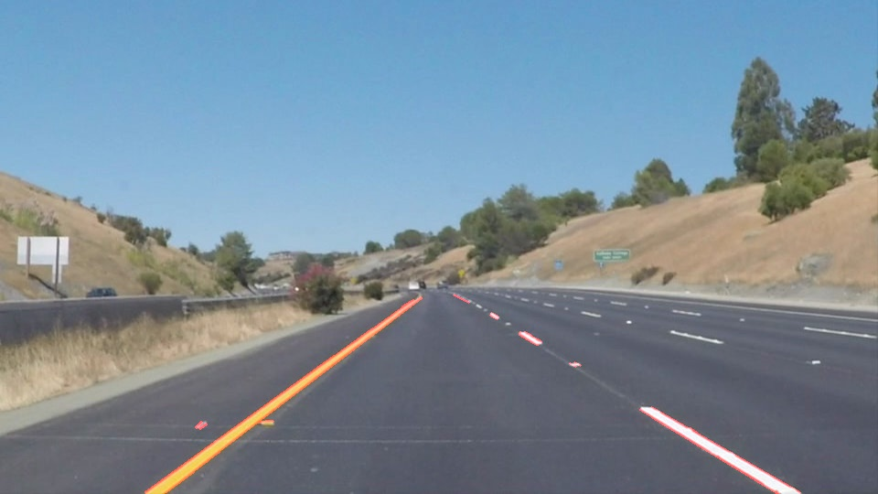
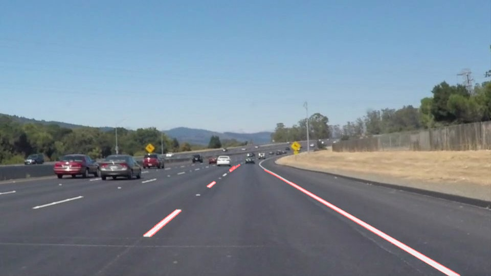
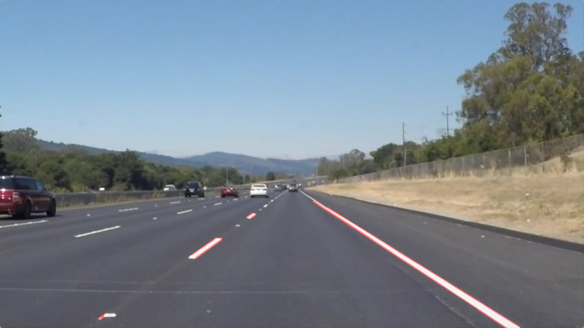
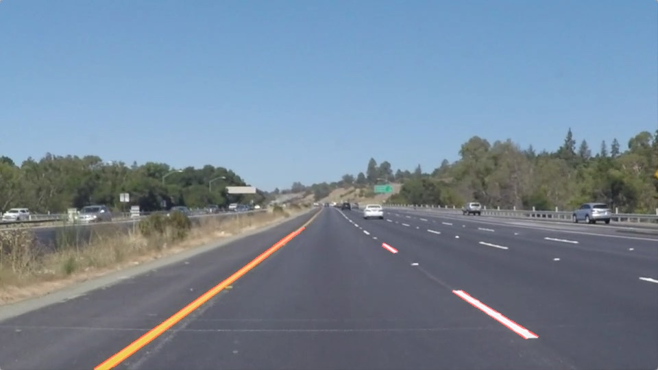
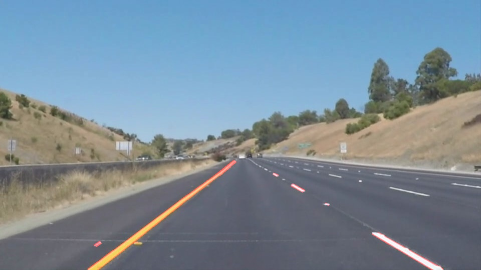
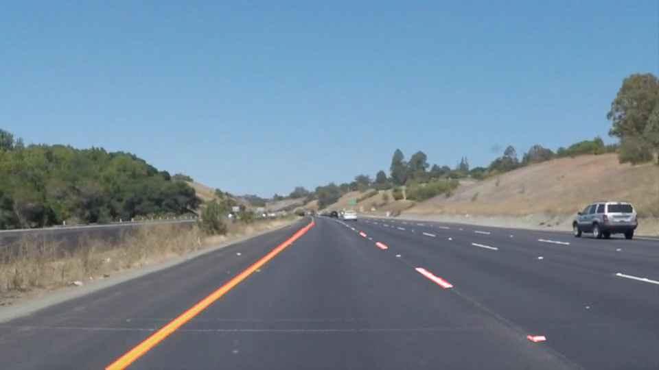

# **Finding Lane Lines on the Road** 
### **1. Building the pipeline**
My pipeline is constructed of 6 steps:

1. I convert the image to grayscale
2. I use gaussian blur with kernel size of 5
3. I use Canny Edge detection with thresholds 50 and 150
4. Then I take only the region that interests me, which is a triangle; left corner, right corner and almoast middle of the image
5. I use Hough Line Transform to detect lines with parameters as follows:

  - rho = 1
  - theta = np.pi/180
  - threshold = 10
  - min_line_length = 6
  - max_line_gap = 5
  
6. Draw the lines on the original image

In order to draw one line instead of all detected in point 5 I changed the draw_lines() function so that it takes all the lines, calculates its slope and center point and categorizes these two variables to the left line or right lane depending on the slope. Then I calculate the average slope, average center point and the second parameter in the line equasion.
Then I calculate the starting points of the lines to be drawn and the intersection of them.

### 2. Potential shortcomings with the pipeline
First is that the average slope can be way of if the HoughLinesP detects some objects like white cars and then the drawn line barely matches the actual line.

Another shortcumming could be with the region of interest. During steep turns the region where lanes are can no longer be put in a single trignale just like I did in the pipeline.
### 3. Possible improvements for the pipeline
One improvement could be some changes to parameters in houghLinesP and canny, that would detect more lines and less background noise

The other improvement would be to take not the average of all line framgents detected (in draw_lines()) but to somehow make more important "closer" lane fragments than those further as they might be less detectable/mistaken for an object like a car
